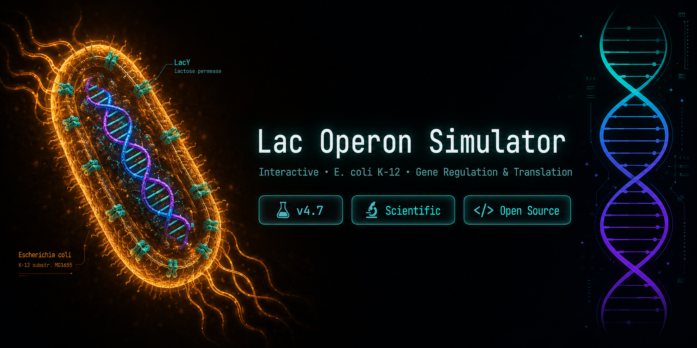

<p align="center">
  
</p>

<h1 align="center">🧬 Operonium</h1>

<p align="center">
  <strong>Where gene regulation comes to life.</strong>
</p>

<p align="center">
  Interactive simulation of the <em>lac operon</em> in <em>Escherichia coli</em> K-12
</p>

<p align="center">
  
  
  
</p>

---

## Overview

Operonium is an interactive educational and scientific visualization platform that demonstrates how the **lac operon** regulates gene expression in *E. coli*.

The simulator models:

* LacI repressor binding and release
* RNA polymerase recruitment
* Operon transcription
* Ribosome-mediated translation
* β-Galactosidase production (LacZ)
* Lactose permease production (LacY)
* Environmental lactose responses
* Dynamic gene regulation states

---

## Features

### 🧬 Gene Regulation

* LacI repressor interactions
* Operator and promoter dynamics
* Inducer-dependent activation

### 📝 Transcription

* RNA polymerase movement
* Real-time mRNA synthesis
* Operon-wide transcription visualization

### ⚙️ Translation

* Ribosome tracking
* Protein synthesis animation
* LacZ, LacY, and LacA production

### 🎓 Educational Visualization

* Molecular animations
* Scientific annotations
* Interactive learning experience

---

## Biological Background

The lac operon is a classic model of bacterial gene regulation.

**Without lactose**

* LacI binds the operator
* RNA polymerase is blocked
* Gene expression is repressed

**With lactose**

* Allolactose inactivates LacI
* Repression is removed
* Transcription begins
* Lac proteins are synthesized

This allows *E. coli* to express lactose-metabolizing genes only when needed.

---

## Operon Architecture

```text
LacI → Promoter → Operator → lacZ → lacY → lacA
```

| Gene | Product                        | Function                                  |
| ---- | ------------------------------ | ----------------------------------------- |
| lacZ | β-Galactosidase                | Breaks lactose into glucose and galactose |
| lacY | Lactose Permease               | Imports lactose into the cell             |
| lacA | Thiogalactoside Transacetylase | Accessory enzyme                          |

---

## Getting Started

```bash
git clone https://github.com/YOUR_USERNAME/Operonium.git

cd Operonium

npm install

npm run dev
```

---

## Roadmap

* [ ] Catabolite repression (CAP–cAMP)
* [ ] Adjustable environmental conditions
* [ ] Experimental mode
* [ ] Data export
* [ ] Additional bacterial operons
* [ ] Mobile optimization

---

## Contributing

Contributions, scientific feedback, and bug reports are welcome.

---

## License

MIT License

---

<p align="center">
  Built for molecular biology education, scientific visualization, and open-source learning.
</p>
